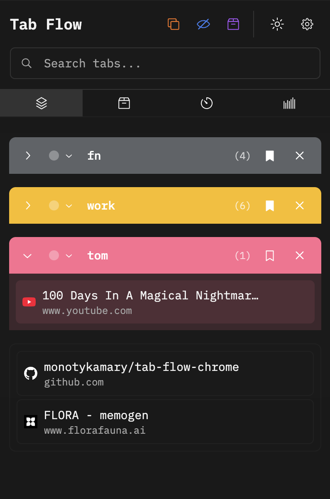
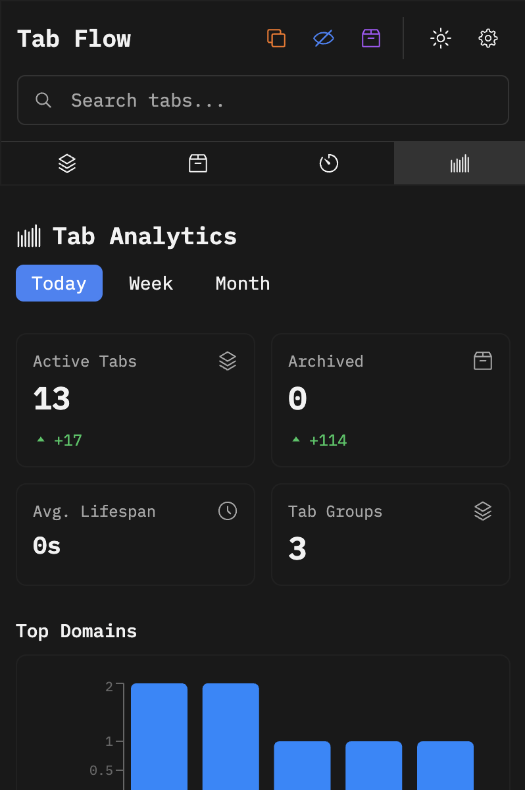
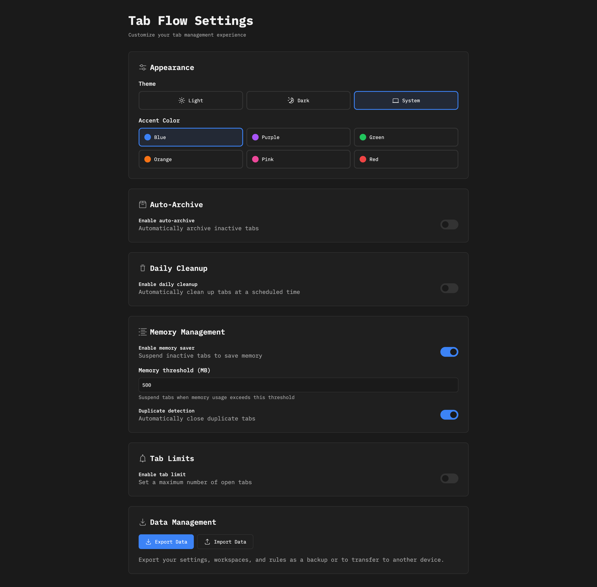

<div align="center">
  
# 🌊 Tab Flow - Modern Tab Manager

A powerful Chrome extension for managing tabs with workflow automation, dark theme support, and smart organization features.

[](https://buymeacoffee.com/monotykamary)
[](https://chrome.google.com/webstore)
[](LICENSE)

</div>

## 📸 Screenshots

<table>
  <tr>
    <td align="center">
      <br/>
      <sub><b>Main Tab View</b></sub>
    </td>
    <td align="center">
      <br/>
      <sub><b>Analytics Dashboard</b></sub>
    </td>
  </tr>
  <tr>
    <td align="center" colspan="2">
      <br/>
      <sub><b>Settings & Configuration</b></sub>
    </td>
  </tr>
</table>

## ✨ Features

### 🎨 Modern UI/UX
- **Dark/Light Theme** - Automatic system theme detection with custom accent colors
- **Glassmorphism Design** - Beautiful frosted glass effects throughout the interface
- **Smooth Animations** - Polished micro-interactions with Framer Motion
- **Keyboard Navigation** - Navigate search results with arrow keys and Enter

### 🤖 Workflow Automation
- **Auto-Archive** - Automatically archive inactive tabs after customizable time
- **Daily Cleanup** - Schedule automatic tab cleanup at your preferred time
- **Duplicate Detection** - Smart duplicate tab detection with exact URL matching
- **Memory Management** - Monitor and limit memory usage with configurable thresholds
- **Tab Limits** - Enforce maximum tab counts with automatic archiving

### 💼 Tab Organization
- **Tab Groups** - Visual organization with customizable colors
- **Save Groups** - Save and restore tab groups as workspaces
- **Bulk Actions** - Close entire groups with one click
- **Search & Filter** - Fast search across all tabs with real-time filtering

### 📊 Analytics & Insights
- **Tab Analytics** - Track active, archived, and closed tabs
- **Domain Statistics** - See your most visited domains
- **Activity Visualization** - Beautiful charts showing tab activity
- **Average Lifespan** - Track how long tabs stay open

## 🚀 Installation

### From Source

1. Clone the repository:
```bash
git clone https://github.com/monotykamary/tab-flow-chrome.git
cd tab-flow-chrome
```

2. Install dependencies:
```bash
npm install
```

3. Build the extension:
```bash
npm run build
```

4. Load in Chrome:
   - Open Chrome and go to `chrome://extensions/`
   - Enable "Developer mode"
   - Click "Load unpacked"
   - Select the `dist` folder

## 🛠️ Development

Start the development server with hot reload:
```bash
npm run dev
```

Build for production:
```bash
npm run build
```

## ⌨️ Keyboard Shortcuts

- `Cmd/Ctrl + Shift + A`: Open Tab Flow and focus search
- `Arrow Up/Down`: Navigate search results
- `Enter`: Switch to selected tab

## 🔧 Technologies

- **React 18** with TypeScript for type-safe development
- **Vite** for lightning-fast builds and HMR
- **Tailwind CSS** for utility-first styling
- **Framer Motion** for smooth animations
- **Radix UI** for accessible components
- **Recharts** for beautiful analytics charts
- **Chrome Extension Manifest V3** for modern extension APIs

## 🤝 Contributing

Contributions are welcome! Please feel free to submit a Pull Request.

1. Fork the repository
2. Create your feature branch (`git checkout -b feature/AmazingFeature`)
3. Commit your changes (`git commit -m 'Add some AmazingFeature'`)
4. Push to the branch (`git push origin feature/AmazingFeature`)
5. Open a Pull Request

## 💖 Support

If you find Tab Flow helpful, consider supporting the development:

<a href="https://buymeacoffee.com/monotykamary" target="_blank">
  
</a>

## 📝 License

This project is licensed under the MIT License - see the [LICENSE](LICENSE) file for details.

## 🙏 Acknowledgments

- Icons from [Radix UI](https://www.radix-ui.com/icons)
- Glassmorphism inspiration from [Glassmorphism.com](https://glassmorphism.com/)
- Built with ❤️ by [monotykamary](https://github.com/monotykamary)